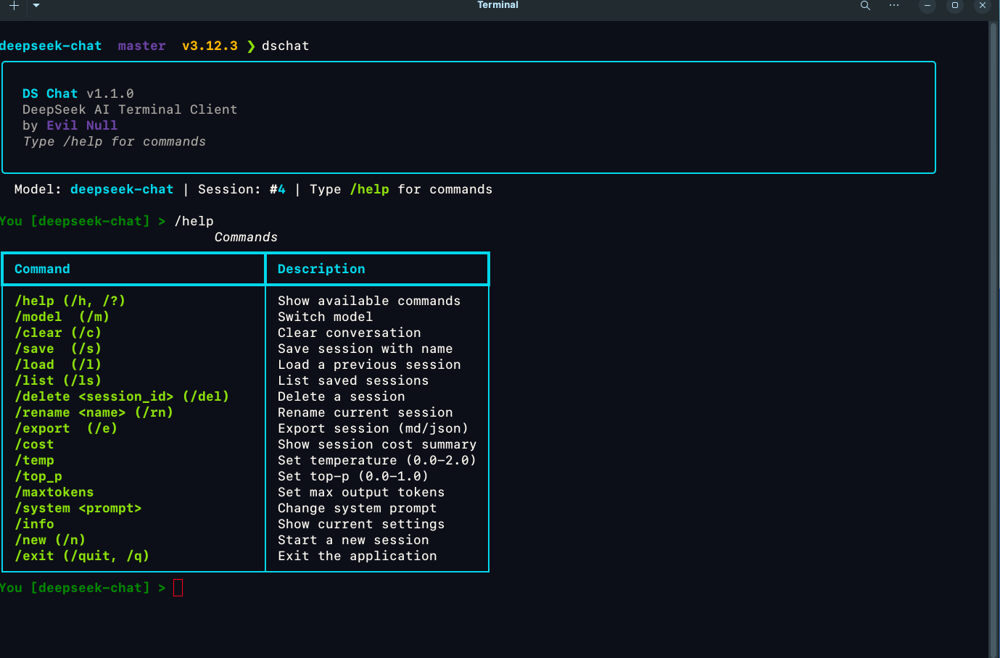

# DS Chat

Professional DeepSeek AI terminal client with real-time streaming, session management, and cost tracking.




## Features

- **Real-time streaming** — responses render as Markdown mid-stream
- **2 models** — deepseek-chat (fast general), deepseek-reasoner (R1 deep reasoning)
- **Reasoning display** — R1 thinking process shown in a separate panel
- **Inline mode** — `dschat -q "question"` for quick one-shot queries
- **Session persistence** — SQLite with full conversation history
- **17 slash commands** — `/help`, `/model`, `/save`, `/load`, `/export`, `/temp`, and more
- **Runtime tuning** — change temperature, top_p, max_tokens on the fly
- **Cost tracking** — per-response and per-session token/cost totals
- **Export** — Markdown or JSON
- **Tab completion** — commands auto-complete, Ctrl+R history search
- **Ctrl+C safe** — cancel mid-stream without corrupting session

## Quick Start

```bash
git clone https://github.com/Evil-Null/deepseek-chat.git
cd deepseek-chat
chmod +x install.sh
./install.sh
```

Or manually:

```bash
python3 -m venv .venv
source .venv/bin/activate
pip install -e .
cp .env.example .env
# Edit .env with your DeepSeek API key
dschat
```

## Requirements

- Python 3.10+
- [DeepSeek API key](https://platform.deepseek.com/api_keys)

## Usage

### Interactive mode (default)

```bash
dschat
```

### Inline mode (one-shot)

```bash
dschat -q "Explain quantum computing in 3 sentences"
dschat -q "Write a Python fibonacci function" -m deepseek-reasoner
```

### CLI flags

| Flag | Description |
|------|-------------|
| `-q "text"` | Ask a question and exit |
| `-m model` | Select model |
| `-v` | Show version |
| `-h` | Show help |

## Configuration

### API Key

Set your key in `.env`:

```
DEEPSEEK_API_KEY=sk-your-key-here
```

### Optional YAML Config

Copy `config.default.yaml` to `~/.config/deepseek-chat/config.yaml` and customize:

```yaml
default_model: deepseek-chat
temperature: 0.2
max_tokens: 4096
top_p: 0.9
show_cost: true
show_reasoning: true
```

## Models

| Model | Description | Input | Output |
|-------|-------------|-------|--------|
| `deepseek-chat` | General chat | $0.14/M | $0.28/M |
| `deepseek-reasoner` | Deep reasoning (R1) | $0.55/M | $2.19/M |

## Commands

| Command | Alias | Description |
|---------|-------|-------------|
| `/help` | `/h` | Show available commands |
| `/model [name]` | `/m` | Switch model |
| `/new` | `/n` | Start new session |
| `/save [name]` | `/s` | Save session with name |
| `/load [id]` | `/l` | Load previous session |
| `/list` | `/ls` | List saved sessions |
| `/delete <id>` | `/del` | Delete a session |
| `/rename <name>` | `/rn` | Rename current session |
| `/export [md\|json]` | `/e` | Export session |
| `/cost` | | Show session cost |
| `/temp [value]` | | Set temperature (0.0-2.0) |
| `/top_p [value]` | | Set top-p (0.0-1.0) |
| `/maxtokens [value]` | | Set max output tokens |
| `/system <prompt>` | | Change system prompt |
| `/info` | | Show current settings |
| `/clear` | `/c` | Clear conversation |
| `/exit` | `/q` | Exit |

## Keyboard Shortcuts

| Key | Action |
|-----|--------|
| `Tab` | Auto-complete commands |
| `Ctrl+R` | Search input history |
| `Ctrl+D` | Exit |
| `Ctrl+C` | Cancel current input / streaming |
| `Alt+Enter` | Newline in input |

## Architecture

```
src/deepseek_chat/
├── __main__.py    # Entry point + CLI args (argparse)
├── config.py      # Pydantic Settings (.env + YAML)
├── models.py      # Data models (+ reasoning_content)
├── api.py         # httpx + SSE delta streaming client
├── streaming.py   # Rich Live display controller
├── db.py          # SQLite persistence
├── ui.py          # Rich rendering components
├── prompt.py      # Prompt Toolkit input
├── commands.py    # Slash command registry (17 commands)
├── export.py      # Markdown/JSON export
└── logger.py      # File-only logging
```

## License

MIT

## Author

**Evil Null**
